# Projecte JavaScript

# Descripción del Proyecto

Bienvenido al proyecto de JavaScript, proyecto el cual añade las siguientes funcionalidades a la web creada en el modelo MVC, en PHP, HTML y CSS, que fue creada en el primer proyecto del curso. Aquí están los diferentes apartados que serán explicados respecto al proyecto de JavaScript:

- [Reseñas del Restaurante](#reseñas-del-restaurante)
- [Programa de Fidelidad](#programa-de-fidelidad)
- [QR para cada pedido](#qr-para-cada-pedido)
- [Filtro de Productos](#filtro-de-productos)

## Reseñas del Restaurante

Para hacer las reseñas del restaurante, he creado una vista que contiene los filtros de las reseñas y el contenedor donde se insertan las reseñas. Para insertar las reseñas, como se puede observar en la imagen de abajo, creo una variable para guardar las reseñas. Luego, hago un fetch a la API para obtener las reseñas que se almacenan en la base de datos.

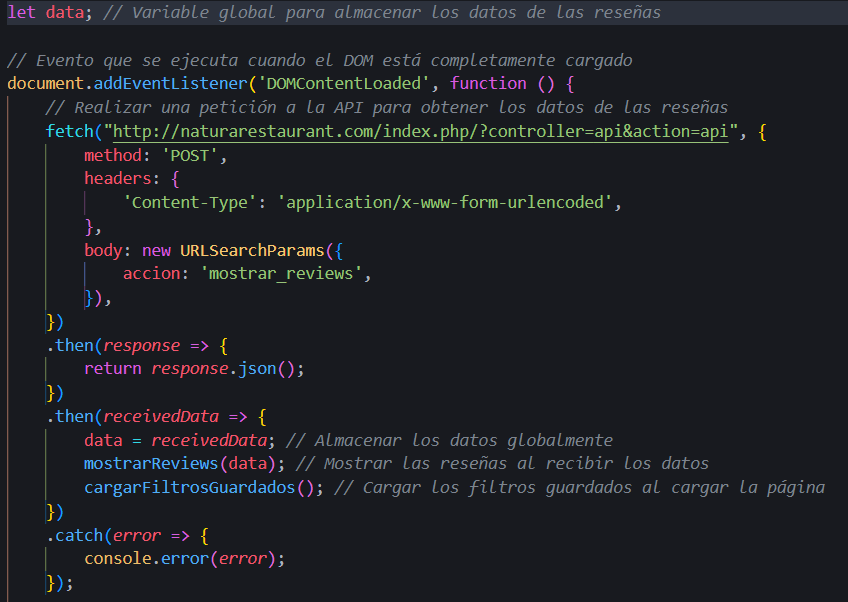

La respuesta de la API se genera de la siguiente manera.

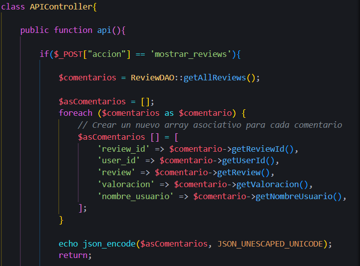

Realizamos una consulta a la base de datos que ejecuta un SELECT de todas las reseñas presentes en la tabla de reseñas de mi base de datos. Luego, al recorrer el array devuelto por la consulta, se almacenan todas las reseñas en un array indexado y se codifican en formato JSON.

Posteriormente, como se ha podido observar en la primera imagen, la respuesta se guarda en una variable global. Luego, se llama a la función encargada de realizar la inserción de las reseñas en el contenedor principal de la vista de reseñas, y se cargan los filtros guardados de la página.

La función encargada de realizar las inserciones de las reseñas es la siguiente:

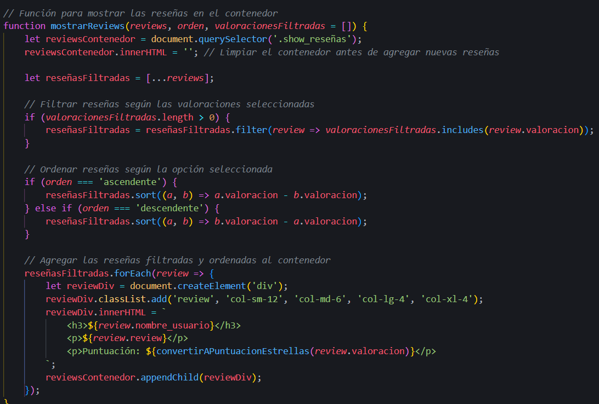

Primero, recoge el contenedor principal y lo limpia para evitar duplicados de reseñas. Luego, se verifican los filtros que puedan estar aplicados y se muestran las funciones correspondientes de los filtros.

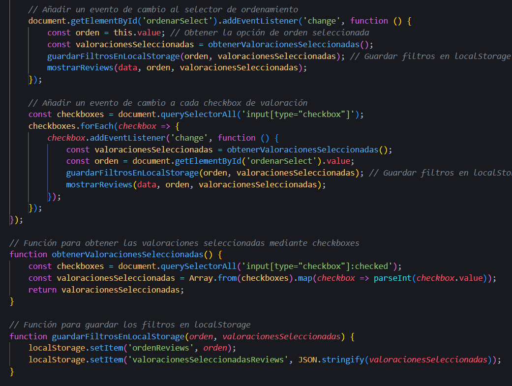

La parte del código que se observa en la imagen de arriba se encarga de comprobar los cambios que se hacen en el filtro y se encarga de obtener los valores de los checkboxes. La imagen de abajo se encarga de guardar las selecciones del filtro en el localStorage para que se apliquen los filtros que ya había antes.

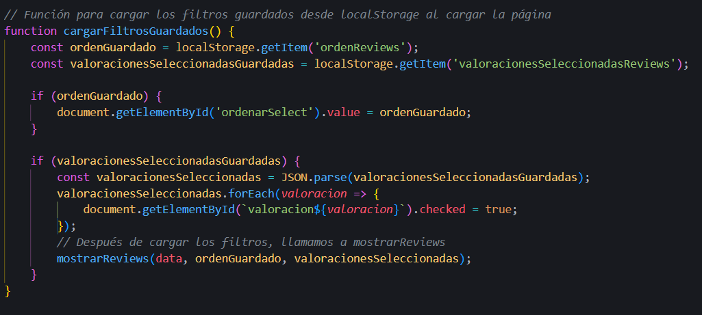

La última parte de las reseñas es la creación de estas, pero las reseñas solo se pueden realizar una por cada pedido del usuario. Para ello, he creado una vista que carga todos los pedidos del usuario y le muestra un botón o un mensaje dependiendo de si el pedido ya tiene un comentario asignado. El código que se encarga de esto es el script 'permision_insert_reviews.js'.

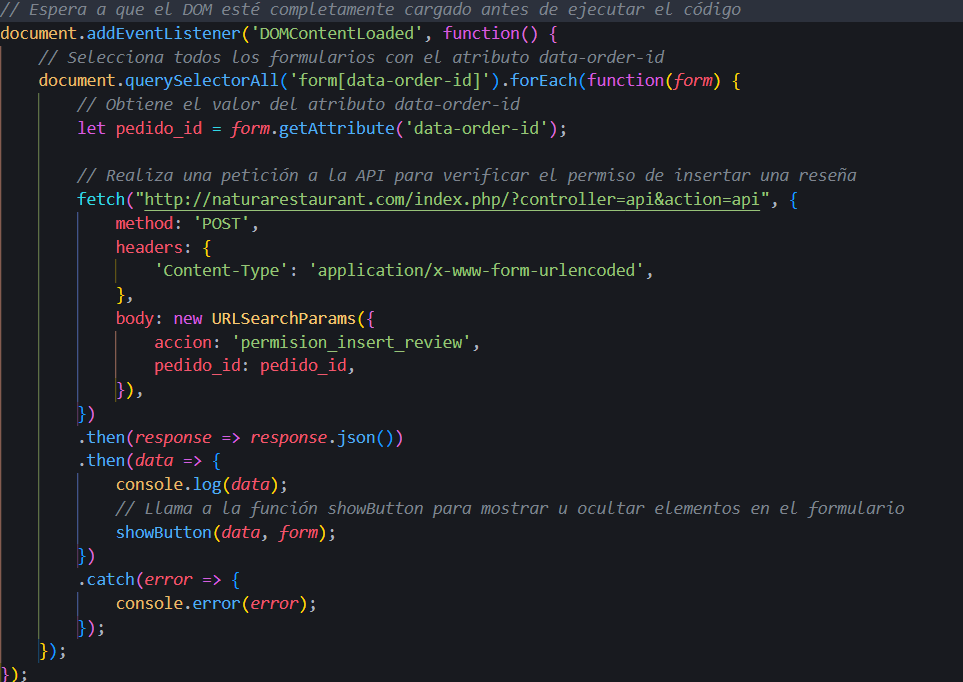

Como se puede ver en la imagen de arriba, se realiza un fetch para consultar si el pedido tiene una reseña o no. Si tiene una reseña, devolverá un false (no se puede añadir una reseña), o true (si se puede realizar la reseña sobre ese pedido). Lo que controla que se muestre o no el botón es la siguiente función.

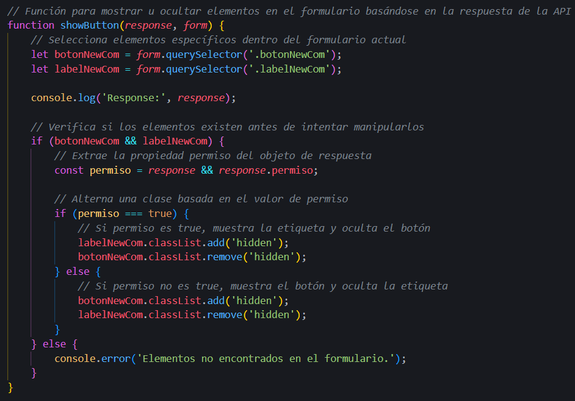

Por último, relacionado con las reseñas, el insert se realiza de la siguiente manera: el usuario rellena el formulario con el comentario y la valoración, seguidamente se realiza un fetch hacia la API con el pedido_id, el comentario y la valoración.

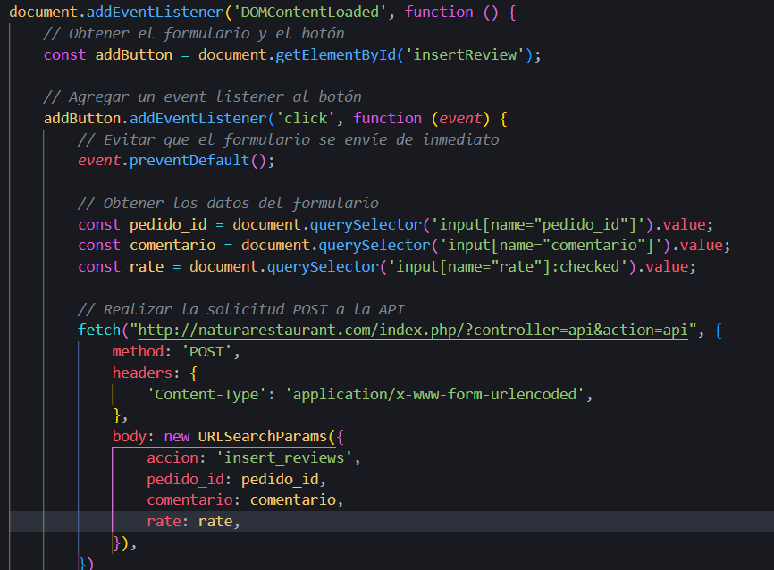

Luego, la API recoge los datos que se le han pasado por la API y el ID del usuario que se encuentra en la sesión. Seguidamente, se llama a la función de la base de datos que se encarga de hacer el insert de la reseña, incluyendo todos los datos necesarios. Lo que devuelve la función será TRUE o FALSE, y esa respuesta se pasa por JSON al fetch, junto con un mensaje de error o éxito dependiendo del caso.

Por último, dependiendo de la respuesta que recibe el fetch de la API, si es un éxito (success), se muestra una notificación utilizando el script noti.js con el mensaje recibido de la API. Después de 5 segundos, se redirige a la página de reseñas para que se pueda ver la reseña que acaba de añadirse.

## Programa de Fidelidad

Para implementar el programa de fidelidad, he añadido un checkbox en la vista original del carrito para decidir si se usan los puntos o no. Si el checkbox está marcado, se mostrará un pequeño formulario con los puntos disponibles y dos botones, uno para restar puntos y otro para sumarlos. Para mostrar o esconder los puntos y para el manejo de estos, he utilizado un sistema similar para las propinas. Se ha añadido un checkbox para ocultar o mostrar el formulario para aumentar y disminuir las propinas. El siguiente script muestra cómo se ha implementado esto.

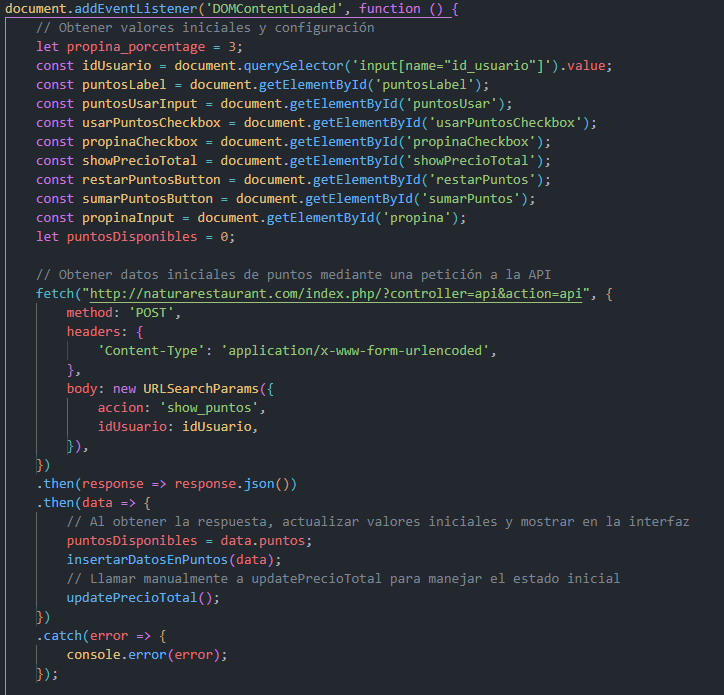

Como se puede observar, en la primera parte del código obtenemos y guardamos en variables los valores iniciales y los componentes que se usarán para manejar los puntos y las propinas. Seguidamente, se utiliza un fetch para obtener los puntos disponibles del usuario. La solicitud a la API se realiza de la siguiente manera:

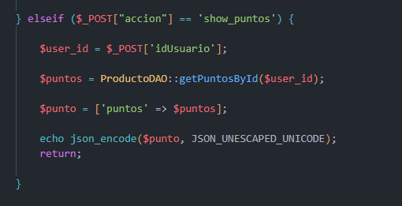

La API recibe el ID de usuario a través del método POST, y con este ID se llama a la función que devuelve los puntos disponibles del usuario. Luego, como en los casos anteriores, guardamos el resultado en un array asociativo, lo codificamos en JSON y lo enviamos. La respuesta obtenida por la API se maneja de la manera que se muestra en la captura de arriba, guardando los puntos en una variable y llamando a una función para que los haga visibles en el carrito.

En esta imagen, encontramos la función que proporciona el valor inicial de los puntos al formulario, así como las funciones encargadas de sumar y restar los puntos que el usuario desea usar, en función de los botones que pulse en el formulario.

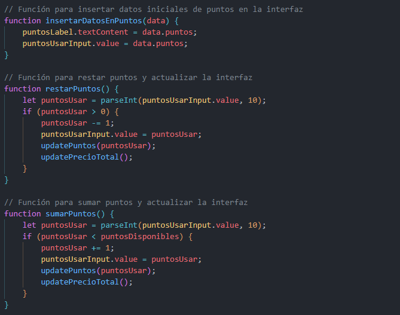

De las dos funciones que encontramos en la siguiente imagen, la primera nos sirve para actualizar los puntos en el formulario, así como la visibilidad de la etiqueta de estos. La segunda función es la encargada de las principales funcionalidades de la gestión del precio final respecto a la propina que se aplique y los puntos de descuento que se usen. Tal y como podemos observar, primero de todo se guardan los puntos que deja marcados el usuario, por defecto todos los disponibles. Luego, se obtiene el precio total sin puntos ni propina.

Seguidamente, encontramos dos condiciones: una que calcula el precio en función de si el checkbox de los puntos está marcado y la otra en función de si el checkbox de las propinas está marcado. Luego, independientemente de si se ha entrado en las condiciones, se muestra el valor total de la compra en el botón. Se muestran u ocultan los formularios de puntos y propinas en función del estado de los checkboxes, y finalmente se muestra el precio total en la interfaz.

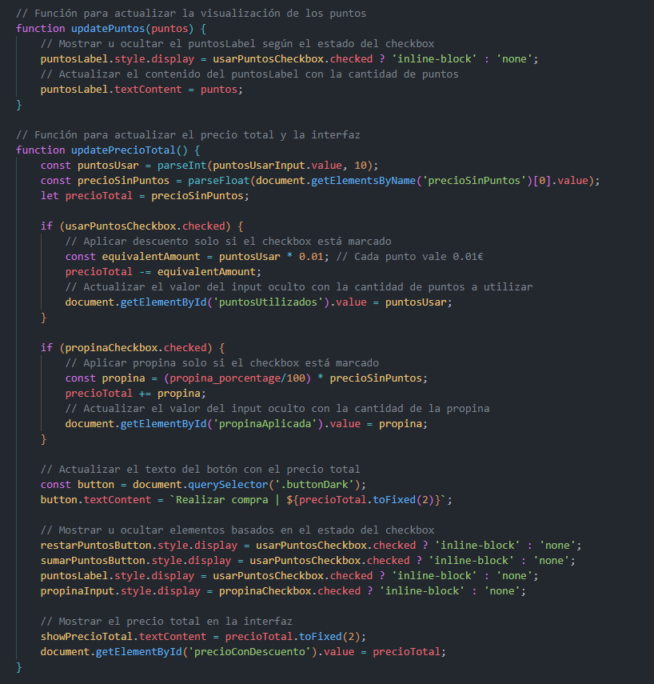

Lo último que se encuentra en este script son los event listeners, que comprueban si el estado del checkbox cambia. Si es así, ejecuta la última función explicada anteriormente. Luego, encontramos otro event listener para ir actualizando el valor del porcentaje de propina que el usuario quiera dejar. Por último, están los event listeners para el formulario de los puntos, los botones que ejecutan las funciones de sumar o restar puntos.

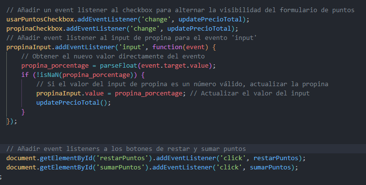

## QR para cada pedido

Para realizar el código QR que, al ser escaneado, nos redirige a una vista con los detalles del pedido realizado, se ha debido cambiar la forma de enviar el formulario al ProductController. Para ello, se ha hecho lo siguiente:

Primero de todo, se guarda en una variable el formulario que se lanza cuando se pulsa el botón de finalizar compra. Se le añade un event listener al botón para que cuando se pulse, se ejecute el código que se ve en la imagen de abajo. Lo primero que encontramos al ejecutar el botón es un prevent default, para evitar el envío inmediato de este. Luego, se realiza una solicitud AJAX para enviar el formulario, y seguidamente se hace un fetch para enviar el formulario de manera asíncrona.

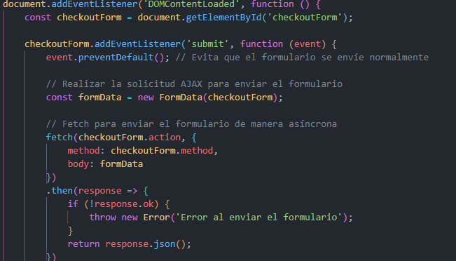

Luego se ejecuta la parte que genera el código QR. Primero, se obtiene el ID del usuario que está realizando la compra, y se guarda junto a la URL que mostrará los detalles de la compra. Seguidamente, se utiliza la biblioteca QRcodeJS para generar el QR. A esta se le pasa la URL que hemos guardado arriba y se especifica el tamaño de este. Las dos siguientes líneas son para poder mostrar la imagen del QR correctamente. Por último, se llama a Sweet Alert para que muestre una alerta con el código QR. Cuando esta alerta sea cerrada, el usuario será redirigido a la página principal (home).

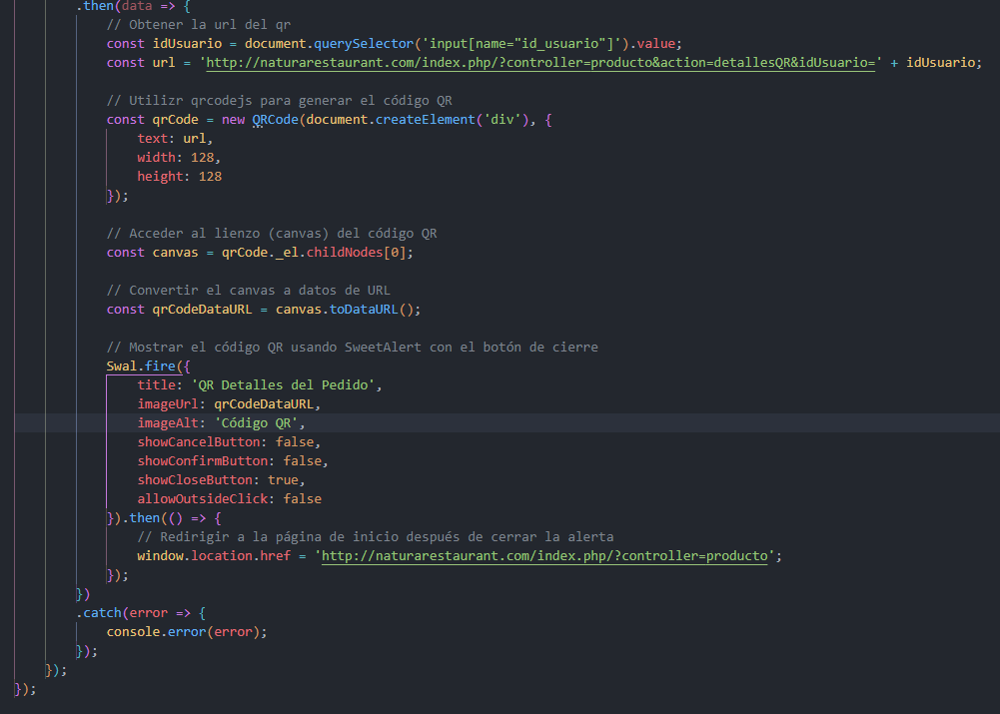

Para mostrar los detalles del pedido del usuario una vez escanea el código QR, se ha hecho a través del ProductoController ya existente, cargando una vista nueva. Como se puede observar en la imagen de abajo, a través del ID de usuario que se pasa en la URL del QR, se realizan las consultas necesarias a la base de datos para obtener los detalles del pedido. Estos detalles se guardan en variables para que estén disponibles en la vista.

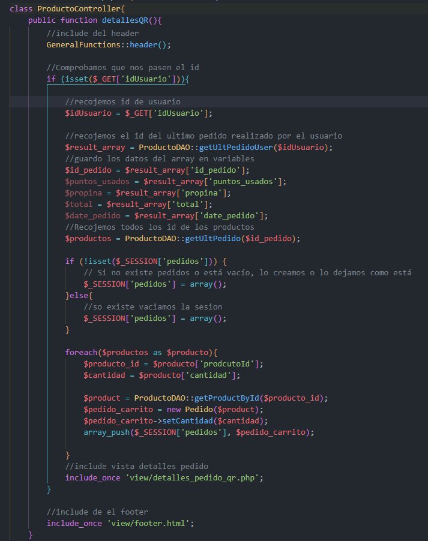

## Filtro de Productos

Para realizar los filtros de los productos, se han añadido event listeners a los checkbox para detectar el cambio de estado de estos. Se guardan todos los productos en una variable y, en función del checkbox que se marca, se muestran los productos que coincidan con el filtro seleccionado. Tal y como se puede ver en el código que se muestra a continuación.

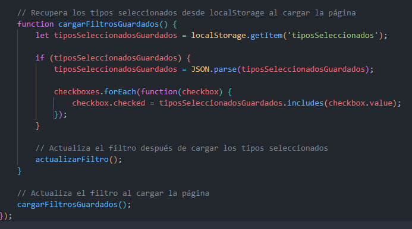
