# Projecte JavaScript

# Descripción del Proyecto

Bienvenido al proyecto de JavaScript, proyecto el cual añade las siguientes funcionalidades a la web creada en el modelo MVC, en PHP, HTML y CSS, que fue creada en el primer proyecto del curso, aqui estan los diferentes apartados que seran explicados respecto al proyrcto de JavaScript:

- [Reseñas del Restaurante](#reseñas-del-restaurante)
- [Programa de Fidelidad](#programa-de-fidelidad)
- [QR para cada pedido](#qr-para-cada-pedido)
- [Filtro de Productos](#filtro-de-productos)

## Reseñas del Restaurante

Para hacer las reseñas del restaurante he creado una vista la cual contiene los filtros de las reseñas y el contenedor donde se insertan las reseñas. Para insertar las reseñas, como se puede observar en la imagen de abajo.

Creo una variable para guardar las reseñas, hago un fetcha a la api para obtener las reseñas que se almacenan en la BBDD. 

La respuesta de la api se genera de la siguiente manera.

Realizamos una consulta a la base de datos la cual hace un select de todas las reseñas que hay en la tabla de reseñas de mi BBDD, luego recoriendo el array que devuelve la consulta, se guardan todas las reseñas en un arrat indexado y lo codifico en json.

Seguidamente como se ha podido ver en el primera imagen la respuesta es almacenada en la variable global y luego se llama a la funcion que se encrga de hacer el insert de las reseñas en el contenedor principal de la vista de reseñas y se cargan los filtros guardados de la pagina.

La funcion que se encrga de realizar los inserts de las reseñas es la siguiente:

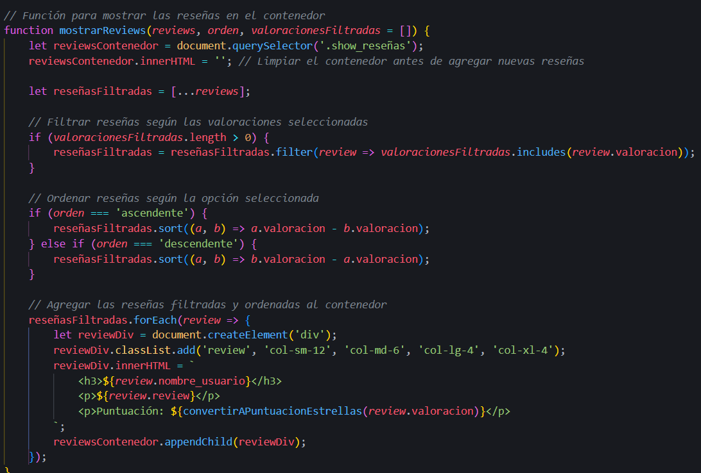

Priemro recoje el contendor principal, y lo limpio para evitar duplicados de reseñas luego se comprueban los filtros que puedan estar aplicados y se musetran las funciones en cuestion de los filtros.

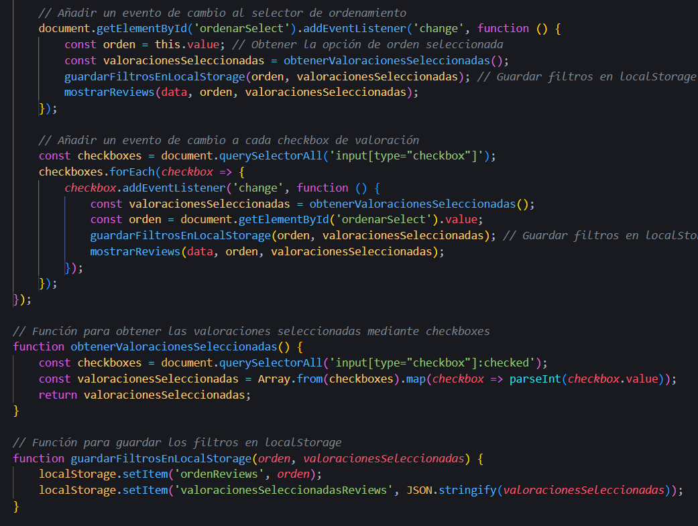

La parte del codigo que se observa en la imagen de arriba, se encarga de comprobar los canvios que se hacen en el flitro y se encrgan de obtener los valores de los chekboxs. Y la iamgen de abajo se encarga de guardar las selecciones del filtro en el localstorage para que se apliquen los filtros que ya habia antes.

La ultmia parte de las reseñas es la creacion de estas, pero las reseñas solo se pueden realizar 1 por cada pedido del usuario, para ello he creado una vista que me carga todos los pedidos del usuario y le muestra un boton o un mensaje en funcion de si el pedido ya tiene un comentario asignado el codigo que se encarga de esto es el script de 'permision_insert_revies.js'.

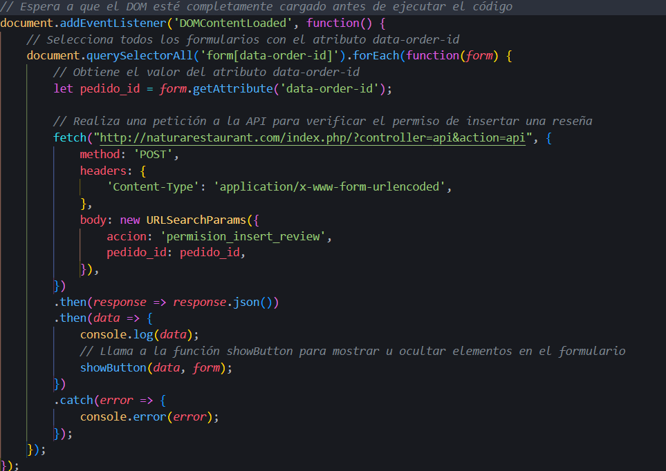

Como se puede ver en la imagen de arriba se reliza un fetch para consultar si el pedido tiene una reseña o no, si tiene una reseña devolvera un false (no se puede añadir una reseña) o true (si se puede realizar la reseña sobre ese pedido). Lo que controla que se muestre o no el boton es la siguiente funcion.

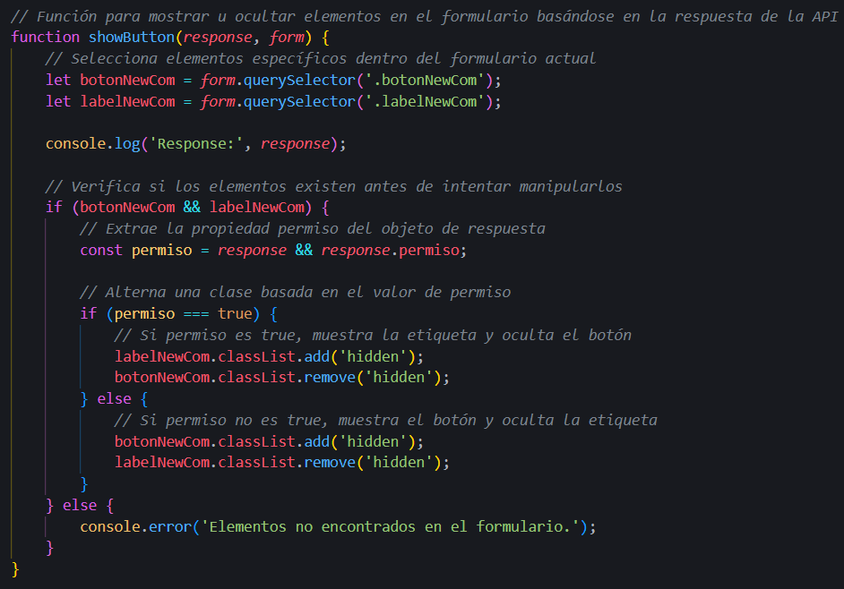

Por ultimo, relazionado con las reseñas, el insert se realiza de la siguiente manera, el usuario rellena el formulario con el comentario y la valoracion, seguidamente se realiza un fetch hacia la api con el pedido_id, el comentario y la valoracion.

Luego la api recoje los datos que se le han pasado por la api y el id del usuario que se encuentran en el la session, sqguidamente llamo a la funcion de la BBDD que se encarga de hacer el insert de la reseña, junto todos los datos necessarios, lo que nos devuelve la funcion que va a ser TRUE o False, y se pasa la respuesta por json al fetch, junto con un mensaje de error o success dependiendo del caso.

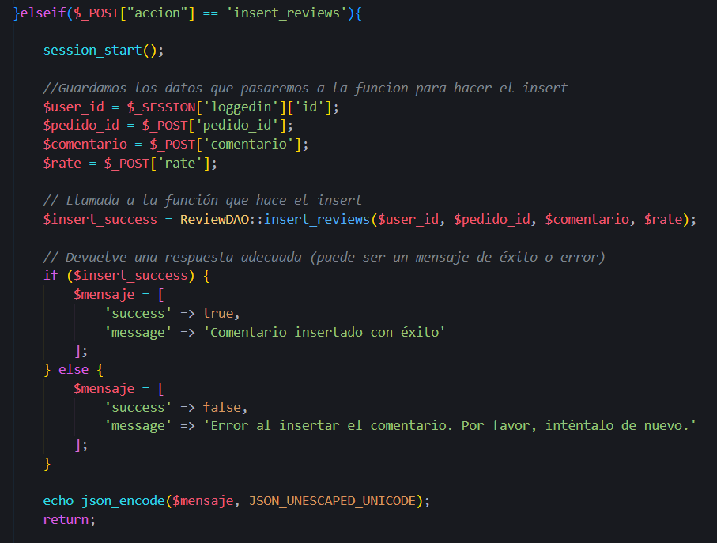

Por ultimo dependiendo de la respuesta que recibe el fetch de la API, si es success, muestra una notificaccion del noti.js con el mensaje que recibi de la api, despues de 5 segundos redirige a la pagina de reseñas para que se pueda ver la reseña que se acaba de añadir

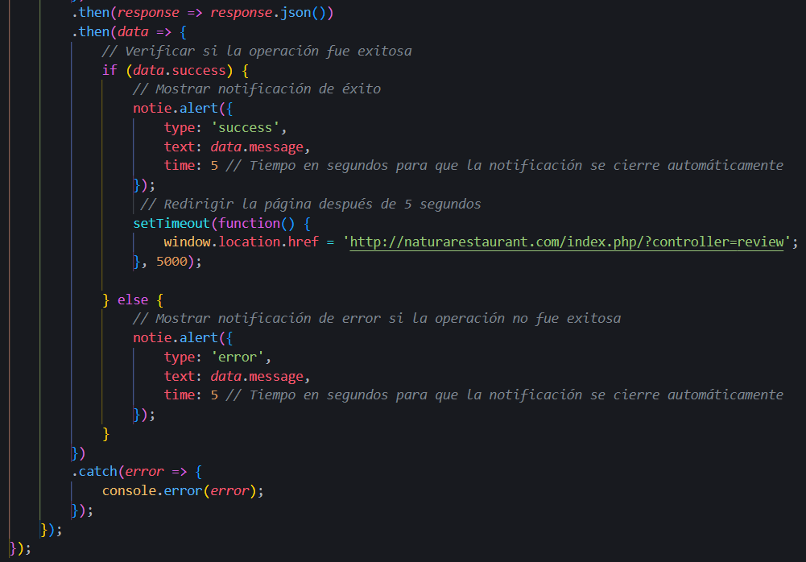

## Programa de Fidelidad

Para hacer el programa de fidelidad, he añadido un chekbox en la vista original del carrito, para dedicir si se usan los puntos o no, si el checkbox es marcado se mostrara un pequeño formulario con los puntos disponibles y dos botones una para restar puntos y otro para sumar-los, para mostrar o esconder los puntos y para el manejo de estos he utilizado, tambien se ha añadido un sistema de propinas, con el mismo metodo que los puntos hay un checkbox para esconder o mostrar el formulario para subir y bajar las propinas, en el siguiente script se muestra como.

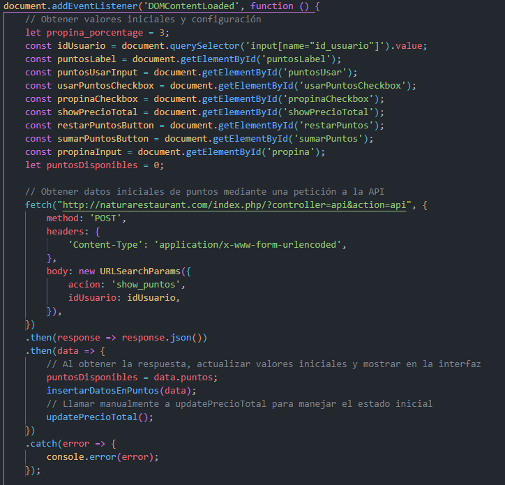

Como se puede observar la primera parte del codigo obtenemos y guardamos en variables, los valores inicales y los componentes que se usaran para manegar los puntos y las propinas. Seguidamente se usa un fecha para obtener los puntos que tiene disponibles el usuario, esto realiza una solicitud a la api, de la siguiente manera:

La api recibe el id de usuario a traves de post, y con este id se llama a la funcion que nos devuelve los puntos disponibles del usuario, y luego como en los casos anteriores guardamos el resultado en un array associativo, lo codificamos en json y lo enviamos. La respuesta obtenida por la api se maneja de la maner que se muestra en la captura de arriba. guadando los puntos en una variable y llamado a una funcion para que los ponga visibles en el carrito.

En esta imagen encontramos la funcion que da el valor inicial de los puntos al formulario, y las funciones que se encargaran de suamr y restar los puntos que el usuario desea usar en funcion de los botones que pulse en el formualrio.

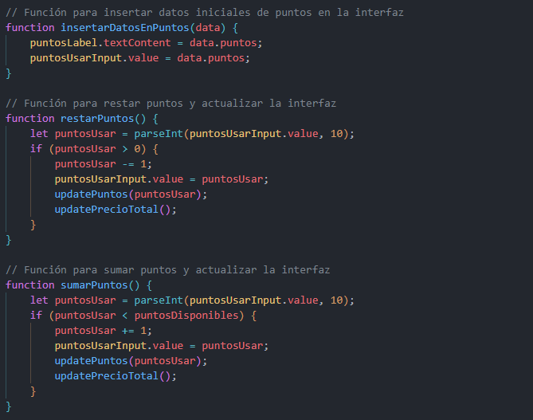

De las dos funciones que encontramos en la siguiente imagen, nos sirve para atualizar los puntos en el formulario asi como la visibilidad de la rtiqueta de estos, y la segunda funcion es la encargada de las principales funcionalidades de la gestion del precio final respecto a la propina que se aplique y los puntos de descuentos que se usen. Tal y como podemos observar, primero de todo se guardan lso puntos que deja marcados el usuario, por defecto todos los disponibles, luego de obtiene el precio total sin puntos ni propina, seguidamente encontramos dos condiciones, uan que calcula el precio en funcion de si el checkbox de los puntos esta marcado y la otra en funcion si el checkbox de las propinas esta marcado, luego indiferent5emente si se ha entrado en las condiciones se muestra el valor total de la compra en el boton, se muestran o se ocultan los formularios de puntos y propinas en funcion del estado de los checkboxs, y por ultimo se muestra el precio total en la interfaz.

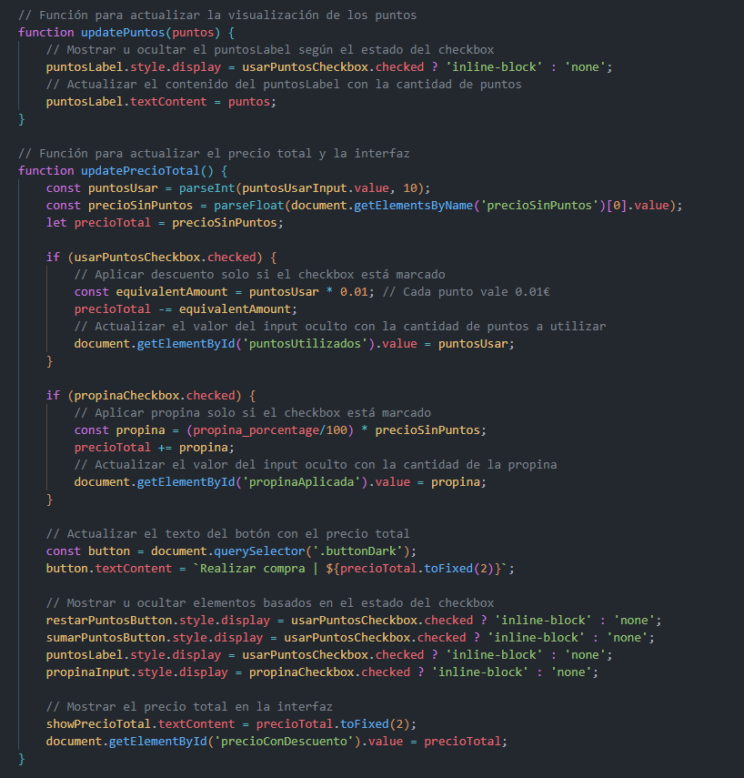

Lo ultimo que se encuentra en este script son los eventlisteners, que comprueban si el estado del checkbox cambia, si es asi ejecuta la ultima funcion explicada arriba, luego encontramos otro eventlistener para ir actualizando el valor del porcentage de propina que el usuario quiera dejar, y por ultimo estan los eventlisteners para el formulario de los puntos, los botones que ejecutan las funciones de sumar o restar puntos.

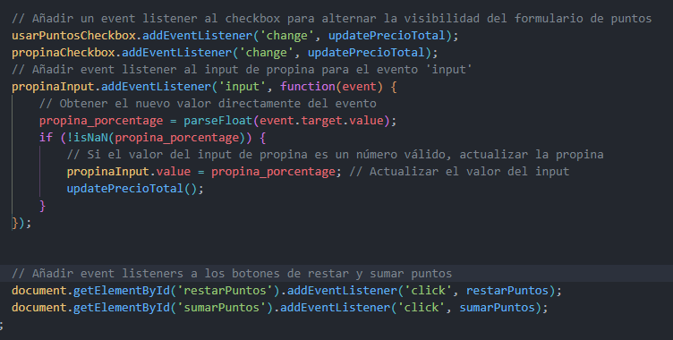

## QR para cada pedido

Para realizar el codigo QR que al ser escanneado nos redirige a una vista con los detalles del pedido realizado, se ha debido de cambiar la forma de enviar el formulario al Prodcutocontroller, para ello se ha echo lo siguiente.

Primero de todo me guardo en una variable el formualrio que se lanza cuando se pulsa el boton de finalizar compra, se le añade un eventlistener al boton par que cuando se pulse el boton se ejecut el codigo que se ve en la imagen de abajo. Lo primero qu encontramos al ejecutra el boton es un prevent default, para evitar el envio imediato de este, luego se realiza una solicitud AJAX para envialr el formualrio, y seguidamente se hace un fetch para enviar el formulario de manera asincrona.

Luego se ejecuta la parte que genera el codigo QR, primero se obtiene el id del usuario que esta realizando la compra, y se guarda junto a la url que mostrara los detalles de la compra, seguidamente utilizo la libreria QRcodeJS para generar el QR, a este se la pasa la url que hemos guardado arriba y se especifica el tamaño de este, las dos siguientes linias son para poder mostrar la imagen del QR correctamente, y por ultimo se llama al sweet alert, par que muestre una alerta con el codigo QR, cuando esta alerta sea cerrada el usuario sera redirigido a la pagina home.

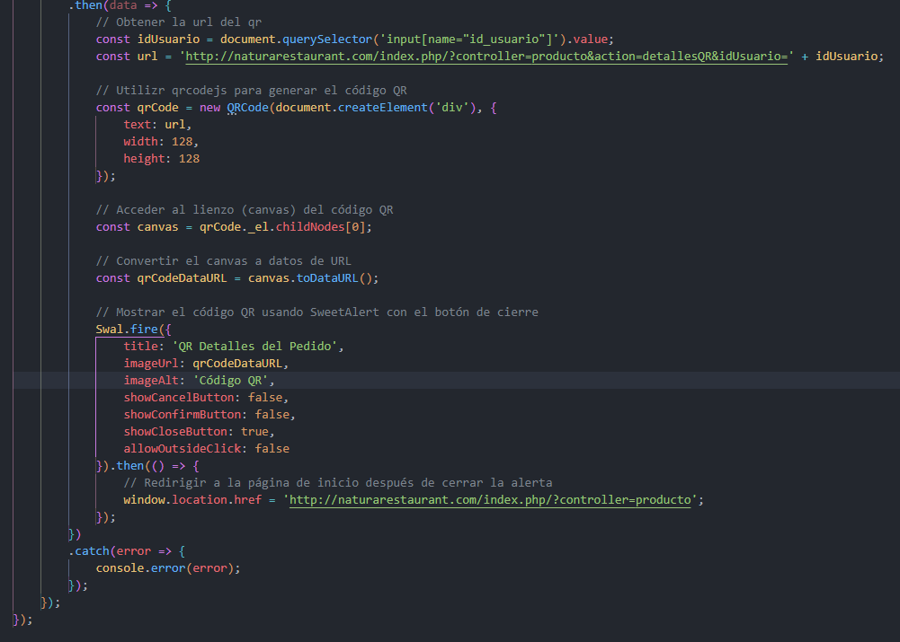

Para mostrar los detalles del pedido del usuario una vez escanea el codigo QR, se ha echo a traves del ProductoController ya exsitente, y cargando una vista nueva. Como se puede observar en la imagen de abajo, a traves del id de usuario que se pasa en la url del QR se realizan las consultas necessarias a la BBDD, para obtener los detalles del pedido, estos se guardan en variables, para que en la vista esten disponibles.

## Filtro de Productos

Para realizar los filtros de los productos, se han añadido eventlisteners a los checkbox, para la deteccion del cambio de estado de estos, guardamos todos los productos en una variable y en funcion del checkbox que se marca, se muestran los productos que coincidan con el filtro seleccionado, tal y como se puede ver en el codigo que se muestra abajo.

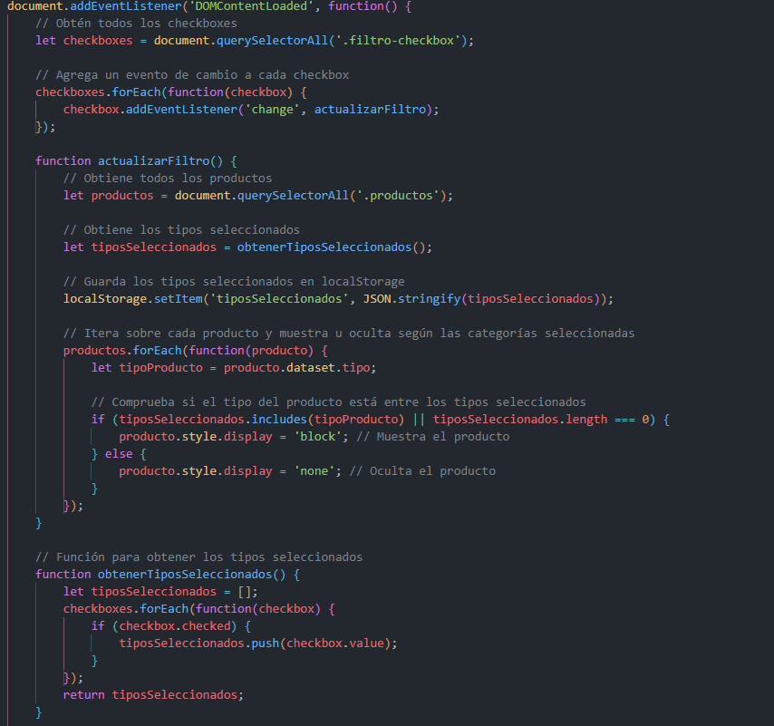

